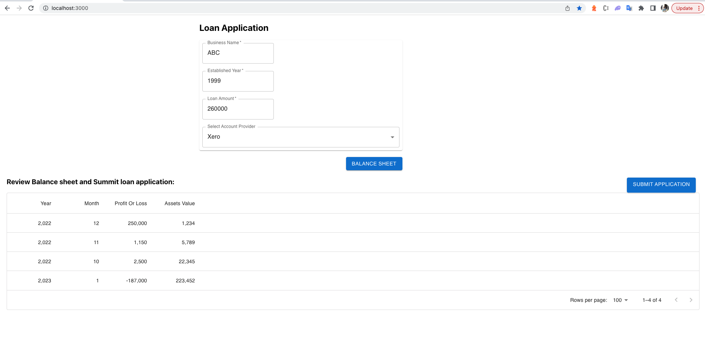

# Loan Application

## Instruction for Backend and Frontend
1) https://github.com/girishg4t/loan-application-system/blob/main/Backend/README.md
2) https://github.com/girishg4t/loan-application-system/blob/main/Frontend/README.md


### How to run the application
1) Create .env file in Backend folder with variable 
```sh
PORT=8080
API_KEY=super-secret
```
2) Run the docker compose command as
```sh
docker-compose up -d   
```

### Working demo
Balance sheet of Business ABC and provider Xero   

Balance sheet of Business XYZ and provider MYOB  

When profit is positive and loan amount is less then asset value   

When profit is positive and loan amount is greater then asset value (only 60 % is approved)

When profit is negative so loan is not approved
